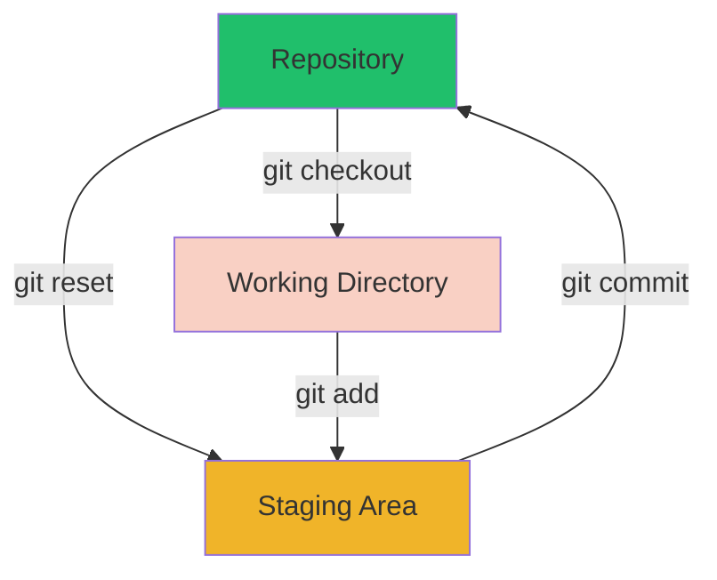
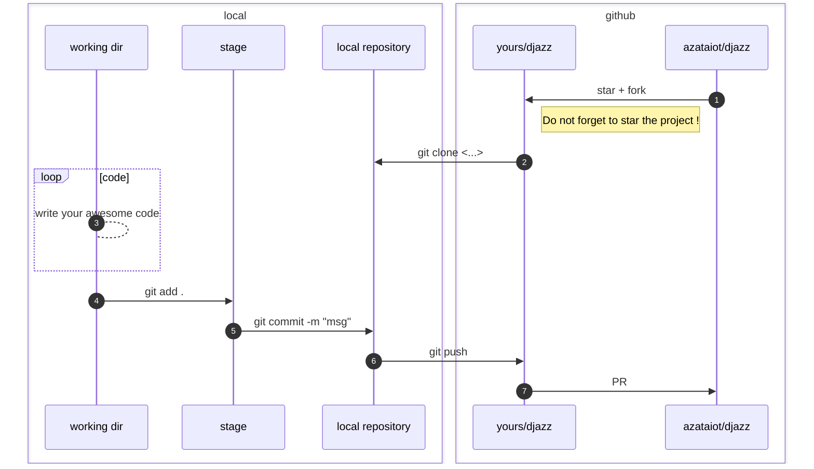

# Git

## Introduction

[Git](https://git-scm.com/) is a distributed [version control](https://en.wikipedia.org/wiki/Version_control) system.
Git was originally authored by [Linus Torvalds](https://github.com/torvalds) (he is also the creator of
the [Linux Operating System](https://github.com/torvalds/linux) ) in 2005 to manage the Linux kernel source code.

Djazz uses Git to manage the source code of the project, and to collaborate with other developers. The project is hosted
on [GitHub](https://github.com/azataiot/djazz). GitHub is a web-based platform that provides Git repository hosting, you
can simply think of it as a Google Drive or Dropbox for code, where people can upload, download, share and collaborate
on code.

Git has a 3 state model:

1. Working Directory: The directory on your local machine where you are working on the code.
2. Staging Area: A temporary area where you can prepare changes before committing them to the repository.
3. Repository: The directory on your local machine where Git stores the history of your project.



You do not necessary use GitHub to use Git, you can use Git locally on your machine without any remote repository. But
using GitHub or any other Git hosting service is a good practice, because it provides a backup of your code, and allows
you to collaborate with other developers.

## Installation

Please refer to the [official Git documentation](https://git-scm.com/book/en/v2/Getting-Started-Installing-Git) for the
installation instructions. Feel free to ask for help if you have any issues in
our [Djazz Discord Server](discord.md).

## Configuration

After installing Git, you need to configure it with your name and email address. This information will be used to
identify you as the author of the code changes.

```bash
git config --global user.name "Your Name"
git config --global user.email "<Your-Email>
```

## Basic Commands



Here are some basic Git commands that you will use frequently while working on the project:

1. to clone the `djazz` repository from GitHub to your local machine:

with using HTTPS:

```bash
git clone https://github.com/azataiot/djazz.git
```

or with using SSH:

```bash
git clone git@github.com:azataiot/djazz.git
```

2. to check the status of the repository:

```bash
git status
```

3. to add changes to the staging area:

```bash
git add . 
# or
# git add <file-name> to add specific file
```

4. to commit changes to the repository:

```bash
git commit -m "Your commit message"
```

5. to push changes to the remote repository:

```bash
git push
```


