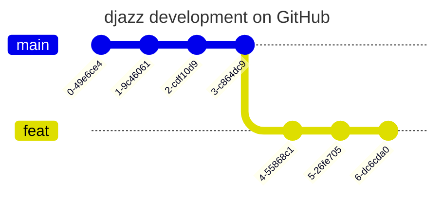
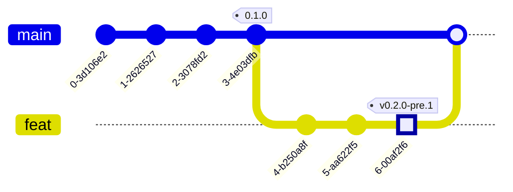
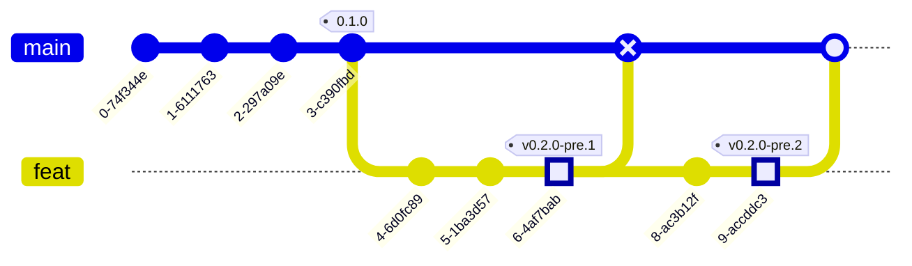

# Djazz Git Workflow

[Git flow](https://nvie.com/posts/a-successful-git-branching-model/) was first introduced in 2010
by [Vincent Driessen](https://nvie.com/about/). It is a branching model that helps developers to work together on a
project. It defines a strict branching model designed around the project release. This model is great for managing large
projects with multiple developers.

Djazz uses combination of Git flow and GitHub
flow. [GitHub](https://docs.github.com/en/get-started/using-github/github-flow) flow is a lightweight, branch-based
workflow that was
introduced by GitHub. It is great for small teams and projects. It is simple and easy to understand.

In djazz, we have one major branch called `main`.

When we want to implement a new feature, we simply create a new branch from `main`

When the feature is ready, we create a pull request to merge the feature branch into `main`.

Each PR, triggers:

- a GitHub action that creates a pre-release tag, for example `v0.2.0-pre.1`
- a GitHub action that runs the tests and checks the code quality, if the tests pass and the code quality is good, the
  PR is merged into `main`.

In case the tests fail or the code quality is not good, the PR is not merged into `main`. The developer has to fix the
issues and create a new PR.

When we are ready to release a new version of the project, we create a new tag from `main`.

After a successful PR, The tag triggers a GitHub action that creates a release. The release is a stable version of the
project.

The release is a stable version of the project. It is ready to be used by the users.

The creation of the release tag, also triggers a GitHub action that creates a GitHub release, as well as A docker image
release and a PyPi package release. The release is a stable version of the project.

